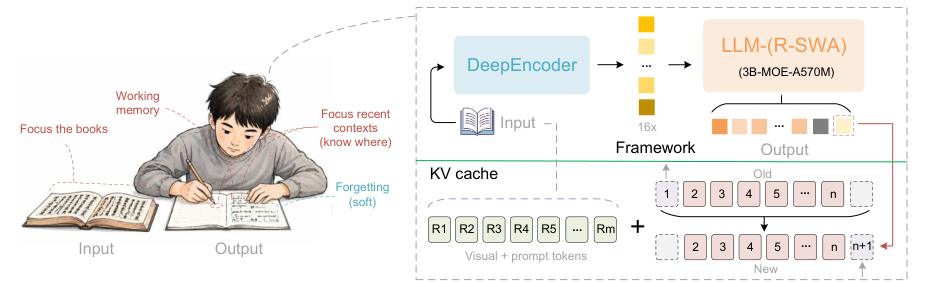

# Omilos OCR

Welcome to the Era of One-shot Long-horizon Parsing.

<p align="center">
    
</p>

## Features

- Single image document parsing with multiple configurations
- Multi-page / PDF document parsing
- Concurrent batch inference via SGLang
- Streaming responses via OpenAI-compatible API

## Inference

### Transformers

Inference using Huggingface transformers on NVIDIA GPUs.

**Requirements:** Python 3.12+ with CUDA

```
torch>=2.0.0
transformers>=4.40.0
Pillow>=10.0.0
matplotlib>=3.8.0
einops>=0.8.0
addict>=2.4.0
easydict>=1.13
pymupdf>=1.24.0
psutil>=7.0.0
```

```python
import os
import torch
from transformers import AutoModel, AutoTokenizer

model_name = 'gokul77898/omilos-ocr-'

tokenizer = AutoTokenizer.from_pretrained(model_name, trust_remote_code=True)
model = AutoModel.from_pretrained(
    model_name,
    trust_remote_code=True,
    use_safetensors=True,
    torch_dtype=torch.bfloat16,
)
model = model.eval().cuda()

# Single image - gundam config
model.infer(
    tokenizer,
    prompt='<image>document parsing.',
    image_file='your_image.jpg',
    output_path='your/output/dir',
    base_size=1024, image_size=640, crop_mode=True,
    max_length=32768,
    no_repeat_ngram_size=35, ngram_window=128,
    save_results=True,
)

# Multi page - base config
model.infer_multi(
    tokenizer,
    prompt='<image>Multi page parsing.',
    image_files=['page1.png', 'page2.png', 'page3.png'],
    output_path='your/output/dir',
    image_size=1024,
    max_length=32768,
    no_repeat_ngram_size=35, ngram_window=1024,
    save_results=True,
)
```

### SGLang Server

Start the SGLang server:

```shell
python -m sglang.launch_server \
    --model gokul77898/omilos-ocr- \
    --served-model-name omilos-ocr- \
    --attention-backend fa3 \
    --page-size 1 \
    --mem-fraction-static 0.8 \
    --context-length 32768 \
    --enable-custom-logit-processor \
    --host 0.0.0.0 \
    --port 10000
```

### Batch Inference

For batch inference on images or PDFs:

```shell
# Image directory
python infer.py \
    --image_dir ./examples/images \
    --output_dir ./outputs \
    --concurrency 8 \
    --image_mode gundam

# PDF pages
python infer.py \
    --pdf ./examples/document.pdf \
    --output_dir ./outputs \
    --concurrency 8 \
    --image_mode gundam
```

**Options:**

| Flag | Description | Default |
|------|-------------|---------|
| `--model_dir` | Model path or Hugging Face ID | `gokul77898/omilos-ocr-` |
| `--gpu` | CUDA device index | `0` |
| `--concurrency` | Parallel requests | `8` |
| `--image_mode` | `gundam` or `base` | `gundam` |

## Visualization


## License

MIT License - see [LICENSE](LICENSE) for details.
